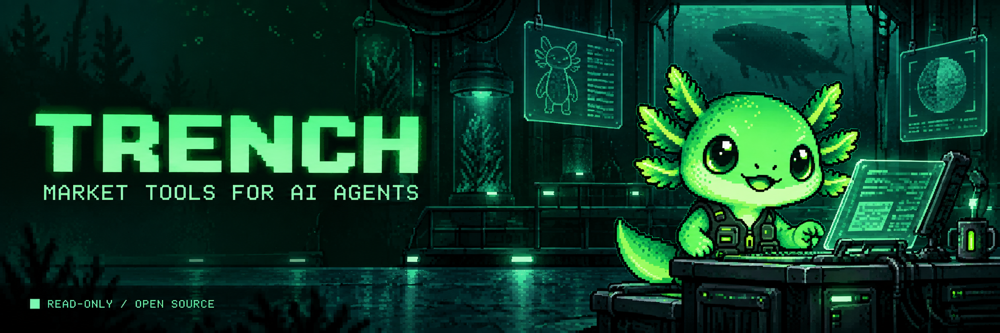
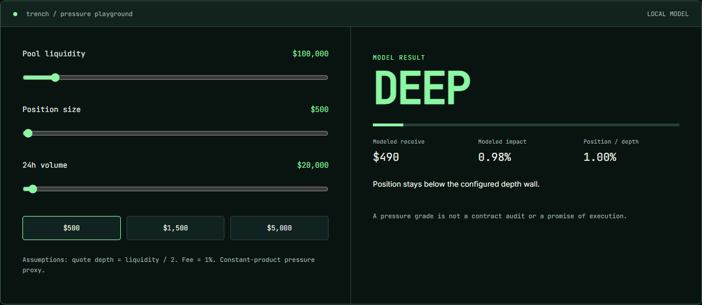

# TRENCH MCP

**Check liquidity before you trust the number.**

TRENCH gives an AI agent observed Robinhood Chain pool data and a transparent, position-size-aware pressure model. The agent gets evidence to explain — not a made-up executable quote.

[Try the browser model](https://trench-mcp.mytodofloopi.workers.dev/#console) · [Connect your agent](#connect-your-agent) · [Read the assumptions](docs/MODEL.md) · [Play Terminal Blocks](https://trench-mcp.mytodofloopi.workers.dev/#arcade)

[](https://github.com/Floopi10/trench-mcp/actions/workflows/ci.yml)
[](https://nodejs.org/)
[](LICENSE)

## Understand it in 20 seconds

| Question | Answer |
| --- | --- |
| What does it do? | Reads token pools and models how a USD position size changes estimated exit pressure. |
| Where is the AI? | Your MCP-compatible AI client calls the tools and interprets their structured results. The pressure calculation is deterministic. |
| Can I try it immediately? | Yes. The browser playground takes manual liquidity, position and volume inputs — no account or wallet connection. |
| Where does live data happen? | The local MCP server reads public DexScreener pools and Robinhood Chain RPC. The website playground is not a live token scanner. |
| Does it execute trades? | No signing, approvals, swaps or custody. It does not look up your wallet balance. |
| Is the result a quote? | No. It is a disclosed constant-product proxy, not a complete Uniswap v4 execution simulation. |



## The problem

AI agents can summarize token pages, read contracts and repeat social posts. That does not answer the operational question a trader actually has:

> **If this position had to exit now, what does the visible market structure suggest?**

Raw liquidity alone is not enough. A `$50K` position and a `$500` position do not face the same market. TRENCH collects the token, position size, observed primary pool, RPC block and an explicit pressure model in one structured MCP result. Pool data and RPC block reads are separate observations, not an atomic block-pinned snapshot.

## What TRENCH is

TRENCH is a real, local-first MCP server for Claude, Codex and any compatible client. It exposes five read-only tools backed by current Robinhood Chain RPC and pool observations.

It does **not** trade. It does **not** accept private keys. It does **not** pretend a constant-product model is an executable quote.

```text
user question
     │
     ▼
AI agent ──MCP/stdio──► TRENCH
                         ├── Robinhood Chain RPC: chain + block
                         ├── DexScreener: pools + liquidity + volume
                         └── SLIP engine: size-aware pressure model
                                      │
                                      ▼
                           evidence + grade + limits
```

## Run it now

Requirements: Node.js 22+.

```bash
npx --yes github:Floopi10/trench-mcp
```

Or install locally:

```bash
git clone https://github.com/Floopi10/trench-mcp.git
cd trench-mcp
npm ci
npm start
```

## Connect your agent

After installing locally, add it to an MCP-compatible client:

```json
{
  "mcpServers": {
    "trench": {
      "command": "node",
      "args": ["/absolute/path/to/trench-mcp/bin/trench-mcp.mjs"]
    }
  }
}
```

Windows example:

```json
{
  "mcpServers": {
    "trench": {
      "command": "node",
      "args": ["C:\\tools\\trench-mcp\\bin\\trench-mcp.mjs"]
    }
  }
}
```

## Tool surface

### `inspect_token`

Reads the strongest visible Robinhood Chain pool for a token and returns price, liquidity, 24-hour volume, activity, pool count and a small-position pressure grade.

```json
{ "token": "0x0000000000000000000000000000000000000000" }
```

### `simulate_exit`

Models a specific USD exit size against estimated quote-side depth. The result includes the `DEEP`, `THIN` or `CRITICAL` grade, estimated receive, pressure percentage and suggested chunks.

```json
{
  "token": "0x0000000000000000000000000000000000000000",
  "sizeUsd": 2500
}
```

### `compare_exit_sizes`

Compares up to eight position sizes against the **same market observation**, preventing time drift between scenarios.

```json
{
  "token": "0x0000000000000000000000000000000000000000",
  "sizesUsd": [100, 500, 2500, 10000]
}
```

### `chain_health`

Returns chain ID, latest block, public RPC URL and observed round-trip latency.

```json
{}
```

### `explain_exit_signal`

Packages the deterministic grade into evidence, limitations and concrete next checks so the host AI can explain a result without inventing a story.

## How the pressure model works

TRENCH uses the highest-liquidity observed pool and approximates quote-side depth as half of total pool liquidity. After a configurable fee assumption, it applies constant-product movement to estimate how much pressure a position introduces.

```text
quote_depth = pool_liquidity / 2
after_fee   = size × (1 - fee_rate)
receive     = quote_depth × after_fee / (quote_depth + after_fee)
impact      = 1 - receive / after_fee
```

Current grade rules:

| Grade | Rule | Meaning |
| --- | --- | --- |
| `CRITICAL` | liquidity below `$10K`, or size above `8%` of estimated quote depth | visible depth is highly constrained |
| `THIN` | size above `2%` of quote depth, or 24h turnover below `5%` | exit pressure deserves caution |
| `DEEP` | none of the walls above are crossed | position is small relative to the observed depth |

These are transparent product rules, not predictions. Read [MODEL.md](docs/MODEL.md) for assumptions and failure modes.

## Agent behavior contract

TRENCH returns facts and boundaries together. A good agent should:

1. State the observation time and available RPC block; do not imply the pool was read at that exact block.
2. Name the selected pool and visible liquidity.
3. Tie the grade to the requested position size.
4. Label modeled impact as a proxy.
5. Recommend checking an executable venue quote before action.

A bad agent hides timestamps, calls the proxy guaranteed output, or converts a grade into financial advice.

## Security boundary

- Every MCP capability is annotated read-only.
- EVM addresses and USD sizes are strictly validated.
- Position size is capped at `$10,000,000`.
- Network requests time out after eight seconds.
- No secrets are accepted, logged or persisted.
- No wallet connection, signing, approval, swap or custody code exists.
- Diagnostics use stderr so stdout remains valid MCP framing.

See [SECURITY.md](docs/SECURITY.md) for the threat model.

## Documentation

- [Architecture](docs/ARCHITECTURE.md)
- [Model and decision walls](docs/MODEL.md)
- [Agent prompts and workflows](docs/AGENT-GUIDE.md)
- [Security model](docs/SECURITY.md)
- [Development and contribution](docs/DEVELOPMENT.md)
- [Verification ledger](docs/VERIFICATION.txt)
- [Project website](https://trench-mcp.mytodofloopi.workers.dev/)

## Development

```bash
npm ci
npm run check
npm run inspect
```

`npm run check` validates syntax and runs unit plus real stdio MCP integration tests. `npm run inspect` opens the official MCP Inspector.

## Current scope

Version `0.1.0` intentionally does one job well: convert current market structure into evidence an AI agent can inspect and explain. Historical monitoring, deployer tracing and executable venue routing are not implemented. They will not be implied in copy until they exist and can be verified.

## Mascot

**Trench** is a terminal-green chibi axolotl carrying a market scanner. The axolotl fits the product: it stays calm in hostile environments, sees what is happening below the surface and does not press the trade button for you.

## Terminal Blocks

A small browser-only falling-block game lives beside the research tools. Use arrow keys to move and rotate, Space to drop, and P to pause while the board is focused. Touch buttons are available on phones.

Clear rows to score. The best score is stored only in this browser through local storage; clearing site data resets it. Switching tabs or scrolling away pauses play. There are no rewards, token gates or wallet connections. The game does not change a market grade.

## Pixel field notes

The main mascot stays a terminal-green pixel axolotl. These companion illustrations add personality without turning the product interface into a toy.

<table><tr><td align="center"><br/><strong>Builder</strong><br/>Check the inputs. Read the source.</td><td align="center"><br/><strong>Diver</strong><br/>Look below the headline number.</td></tr></table>

## What is tested

`npm run check` runs syntax checks and the test suite, including real stdio MCP integration tests, 108 synthetic browser/server model comparisons, and game-engine rotation, collision, row-clearing and game-over checks.

Tests verify implementation behavior. They do not certify a token, guarantee provider availability, or make the modeled proceeds executable. Live results can change between requests.

## License

MIT
